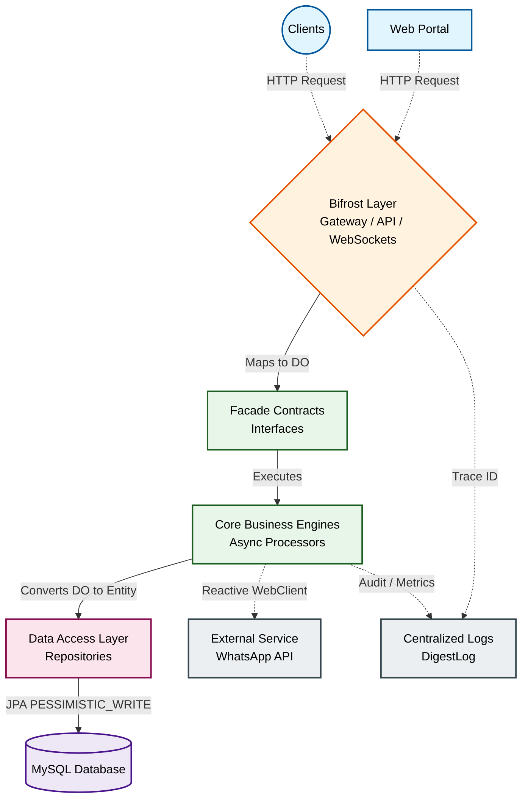

# EzClouds Election Management System

A high-concurrency, enterprise-grade election management and real-time data aggregation platform. Designed from the ground up to handle voter canvassing, demographic reporting, and large-scale data synchronization in a distributed environment.

## 🏗️ Architectural Overview

This project is structured as a **Multi-Module Maven application**, utilizing a strict layered architecture (Clean Architecture/Hexagonal) to enforce separation of concerns and ensure long-term maintainability.

### System Flow

### Module Breakdown
- `bifrost` **(Gateway Layer):** Acts as the primary entry point for HTTP and WebSocket traffic. It isolates the web-framework logic from the core business domain.
- `core` **&** `app` **(Domain Layer):** Contains the business engines, including complex data aggregation, async ThreadPool processing, and integration logic.
- `dal` **(Data Access Layer):** An abstraction layer that strictly decouples JPA/Hibernate entities from the business services using Data Objects (DO).
- `common` **(Infrastructure/Cross-cutting):** Centralized utilities, shared models, thread-local context holders, and custom operational logging.

## ⚙️ Key Technical Decisions
- **Concurrency & Consistency over Throughput:** Implemented `Pessimistic Locking` (via JPA `@Lock(LockModeType.PESSIMISTIC_WRITE)`) on report accumulation processes to prevent "Lost Update" anomalies during high-frequency vote canvassing.
- **Structured Operational Logging:** Developed a custom `DigestLog` utility to capture structured metrics (TraceID, TimeCost, SuccessFlag) for every request. This enables deep observability and request-tracing across modules without the need to parse raw text.
- **Strategy Pattern for Async Processing:** Utilized a `Map<ProcessName, BizAsyncProcessor>` dynamically injected by Spring to route asynchronous tasks, avoiding monolithic switch-case logic and ensuring clean extensibility.
- **Memory & Connection Pool Optimization:** Set `spring.jpa.open-in-view=false` to enforce efficient session management and strictly isolate database transactions from view rendering.

## 🛠️ Technology Stack
- **Core Framework:** Java 8+, Spring Boot 2.x
- **Database:** MySQL (Optimized with Hibernate/JPA)
- **Integration:** Spring WebFlux (Reactive `WebClient`) for 3rd-party communications
- **Build System:** Maven (Multi-Module)
- **Architecture:** Domain-Driven Design (DDD) principles, Clean Architecture

## 🚀 Deployment & Operations
The system is designed to be operationally resilient in resource-constrained environments. It utilizes a custom, script-based orchestrator (`run.sh`, `start.sh`, `stop.sh`) to manage the JVM lifecycle, handle environment variable injection, manage PID tracking, and execute automated artifact backups during deployments.

## 🗺️ Roadmap & Future Improvements
While the core system is fully functional and designed to serve production traffic, future iterations will focus on scaling the operational infrastructure:
1. **Integration Testing:** Implementing containerized testing suites using Testcontainers to validate database transactions and repository layer locking mechanisms.
2. **Resilience Engineering:** Integrating **Circuit Breaker** patterns (via Resilience4j) into the external communication services to gracefully handle API timeouts.
3. **CI/CD Pipeline:** Migrating the manual shell-script deployment process to GitHub Actions for automated delivery.

Created and maintained independently by Heri Wijoyo
